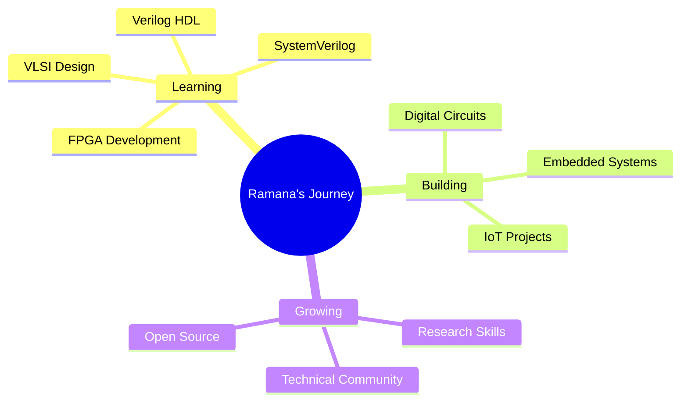

<div align="center">

<!-- Banner -->


</div>

<div align="center">

[](https://psvramana40248.vercel.app)
[](https://www.linkedin.com/in/pusarla-sai-venkat-ramana-a44931300/)
[](mailto:psvr120205@gmail.com)
[](https://www.instagram.com/pusarla_ramana/)


</div>

---

## 🎯 About Me

```typescript
const ramana = {
  location: "India 🇮🇳",
  education: "B.Tech ECE (VLSI) @ KL University",
  role: "VLSI Enthusiast | Digital Design Learner | Electronics Engineer",
  currentFocus: ["VLSI Design", "Verilog HDL", "SystemVerilog", "FPGA Development"],
  passion: ["Digital Logic Design", "Embedded Systems", "Hardware Verification"],
  superpower: "Turning Theory into Practical Hardware Solutions",
  motto: "Transforming Ideas into Silicon and Innovation Through Design ✨",
  funFact: "I enjoy implementing digital systems and verifying them using SystemVerilog!",
  openTo: ["Internships", "Research", "Collaborations", "Learning Opportunities"]
};
```


### 🚀 What Drives Me

- 💻 **Digital Design Enthusiast** — Passionate about hardware design and verification.
- ⚡ **VLSI Learner** — Exploring semiconductor and chip design technologies.
- 🔧 **Embedded Systems Developer** — Building practical hardware solutions.
- 🧩 **Problem Solver** — Converting concepts into real-world implementations.
- 📚 **Continuous Learner** — Exploring emerging technologies in VLSI.
- 🎯 **Detail-Oriented** — Focused on optimization and precision.

<br clear="right"/>

---

## 🏆 Achievements & Recognition

<table>
<tr>
<td width="50%">

### 🥇 Academic Excellence
- 🏆 **CGPA 9.77** — B.Tech ECE (VLSI)
- 🥇 **100%** — SSC Examination
- 🥈 **96.2%** — Intermediate (MPC)

</td>
<td width="50%">

### 📜 Certifications
- ✅ IoT & Embedded Systems
- ✅ Salesforce AI
- ✅ SystemVerilog
- ✅ AI & ML Python Basics
- ✅ MS Office & C Basics
- ✅ Spectre Fundamentals (Cadence vSPECTRE23.1)

</td>
</tr>
<tr>
<td colspan="2">

### 🎓 Academic Journey
- 🎓 B.Tech ECE (VLSI) — KL University
- 🎓 BBA (Online) — KL University
- 👥 Active Learner in VLSI, FPGA & Embedded Systems

</td>
</tr>
</table>

---

## 💼 Featured Projects

<div align="center">

| Project | Description | Tech Stack |
|---------|-------------|------------|
| 🎮 **Interactive Arduino Games** | 2048 and Super Mario using Arduino and button inputs | Arduino, C++, Game Dev |
| ➕ **8-Bit Adder Using SystemVerilog** | High-performance 8-bit adder with verification | SystemVerilog, UVM, FPGA |
| 🌱 **Smart Plant Monitoring System** | Soil moisture monitoring using STM32 for agriculture | STM32, IoT, Sensors |
| 🚗 **Bluetooth Controlled Car** | Smartphone-controlled robotic car using Arduino & HC-05 | Arduino, Bluetooth, Robotics |
| 💡 **Smart Street Light System** | Energy-efficient lighting using IR & LDR sensors | Arduino, IoT, Sensors |
| 🔄 **SPI Slave Implementation** | Verilog-based SPI slave module for FPGA communication | Verilog, SPI, FPGA |

</div>

---

## 🛠️ Tech Arsenal

<div align="center">

### Languages


### Hardware Design


### Development Tools


### IoT & Embedded


### Tools & Others


</div>

---

## 📊 GitHub Analytics

<div align="center">


</div>

---

## 🏆 GitHub Trophies

<div align="center">

[](https://github.com/ryo-ma/github-profile-trophy)

</div>

---

## 📈 Contribution Graph

<div align="center">


</div>

---

## 💭 Dev Quote

<div align="center">


</div>

---

## 🎯 Current Focus



---

## 🤝 Let's Connect & Collaborate!

<div align="center">

I’m always excited to connect with fellow engineers, researchers, and developers working in VLSI, FPGA, Embedded Systems, and Digital Design.

### 📬 Reach Out

[](https://www.linkedin.com/in/pusarla-sai-venkat-ramana-a44931300/)
[](https://www.instagram.com/pusarla_ramana/)
[](https://psvramana40248.vercel.app)
[](mailto:psvr120205@gmail.com)

### 💼 Open For
- 🔬 VLSI Internships
- ⚡ FPGA Development Projects
- 🤝 Research Collaborations
- 🔧 Embedded Systems Projects
- 🌐 IoT Development
- 🚀 Technical Networking

</div>

---

<div align="center">

### 🌟 "Transforming Ideas into Silicon and Innovation Through Design" ✨

**Thanks for visiting! Let's build the future together 🚀**


</div>

---

<div align="center">

**Made with ❤️, ☕, and countless hours of engineering by PUSARLA SAI VENKAT RAMANA**


*Last Updated: August 2026*

</div>
